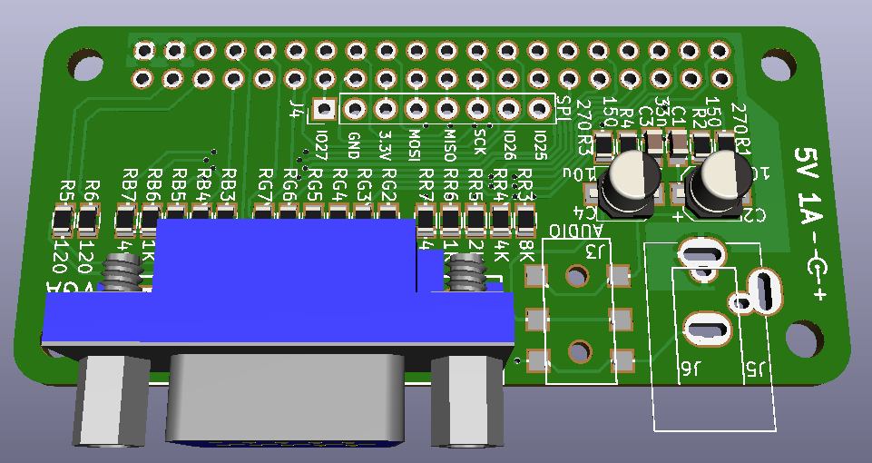

[:fr:](LISEZMOI.md) [:uk:](README.md)

# VGA_Zero
VGA interface for Raspberry Pi Zéro &amp; 2,3,B+

bye on ebay : https://www.ebay.fr/itm/153295944438

### DPI (Display parallel Interface)
this pcb use the dpi mode 3

see https://www.raspberrypi.org/documentation/hardware/raspberrypi/dpi/README.md

only the necessary bits of the dpi are redirected to the 40-pin GPIO port, with the [vga565.dtbo]((overlays/vga565.dtbo?raw=true) file loaded at startup

here is the code of the file:

    /dts-v1/;
    /plugin/;
    /{
    	compatible = "brcm,bcm2708";
    	// There is no VGA driver module, but we need a platform device
    	// node (that doesn't already use pinctrl) to hang the pinctrl
    	// reference on - leds will do
    	fragment@0 {
    		target = <&leds>;
    		__overlay__ {
    			pinctrl-names = "default";
    			pinctrl-0 = <&vga565_pins>;
    		};
	    };
    	fragment@1 {
    		target = <&gpio>;
    		__overlay__ {
    			vga565_pins: vga565_pins {
        			brcm,pins = <2 3 4 5 6 7 8 12 13 14 15 16 17 20 21 22 23 24>;
    				brcm,function = <6>; /* alt2 */
				    brcm,pull = <0>; /* no pull */
			    };
		    };
	    };
    };

### Audio Interface
and use audio from pin gpio 18 & 19

and https://learn.adafruit.com/adding-basic-audio-ouput-to-raspberry-pi-zero/pi-zero-pwm-audio

### SPI Interface
GPIO 9 , 10, 11 , 25, 26, 27 can be used as SPI , whit overlay spi0-cs, with CS redirection to gpio 26 & 27

    # uncomment to use spi0 with cs0 & cs1 retirected on pin 26 & 27 
    dtparam=spi=on
    dtoverlay=spi0-cs,cs0_pin=26,cs1_pin=27

## Schematic

## PCB

## Installation
Copy [vga565.dtbo](overlays/vga565.dtbo?raw=true) in /boot/overlays/
and copy content of [config-example.txt](overlays/config-example.txt?raw=true) in /boot/config.txt

## Révision
rev1
- bad vga footprint, hole too small

rev2
- change vga footprint
- move j3 & j5
